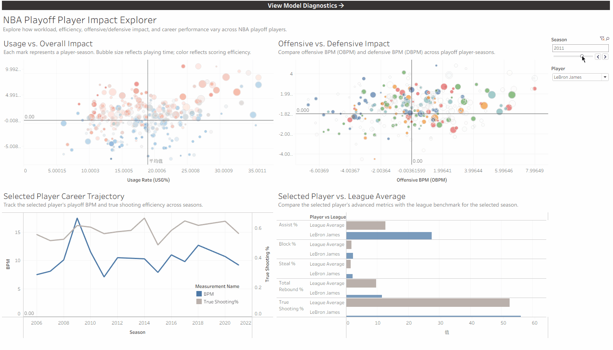

# NBA Playoff Player Impact Dashboard

An interactive Tableau dashboard that visualizes NBA playoff player performance, workload-efficiency trade-offs, and machine learning model diagnostics. Built as a companion to an [XGBoost-based BPM prediction study](https://github.com/xiaoyang-su/NBA-playoff-data-analysis), this project translates statistical modeling results into explorable visual analytics.



---

## Dashboard Views

The workbook contains two linked views with cross-navigation between player analytics and model diagnostics.

### NBA Playoff Player Impact Explorer

Explore how workload, efficiency, offensive/defensive impact, and career performance vary across NBA playoff players.

- **Usage vs. Overall Impact** — Scatter plot of Usage Rate (USG%) against Box Plus/Minus (BPM). Bubble size reflects playing time; color reflects scoring efficiency (True Shooting %). Reveals which players sustain high-volume roles while maintaining positive impact.
- **Offensive vs. Defensive Impact** — Scatter plot comparing Offensive BPM (OBPM) and Defensive BPM (DBPM) across all filtered player-seasons. Identifies two-way contributors versus one-dimensional players.
- **Selected Player Career Trajectory** — Dual-axis line chart tracking a selected player's BPM and True Shooting % across playoff seasons. Highlights career arcs, peak windows, and decline patterns.
- **Selected Player vs. League Average** — Horizontal bar chart comparing the selected player's advanced metrics (Assist %, Block %, Steal %, Total Rebound %, True Shooting %) against the league-average benchmark for the chosen season.

Interactive filters allow selection by **Season** and **Player**. Clicking a mark in the scatter plots updates the career trajectory and comparison panels.

### Model Diagnostics & Explainability

Evaluate predictive performance and identify the statistical features most associated with modeled playoff impact.

- **Normalized Feature Importance (%)** — Horizontal bar chart showing the relative contribution of each model feature to BPM predictions. Features are color-coded by category (Shooting Efficiency, Defense, Playmaking, Offensive Load, Discipline, Rebounding, Ball Security, Position). Top drivers include True Shooting % (27.18%), Field Goal % (14.28%), Steal % (11.65%), and Assist % (10.45%).
- **Actual vs. Predicted BPM** — Scatter plot of true BPM against XGBoost-predicted BPM. Points closer to the diagonal indicate more accurate predictions. Color encodes prediction error category (Above Prediction, Below Prediction, Near Prediction). Model summary: XGBoost, 5-fold cross-validation, R² = 0.90, unit of analysis is player-season.

Navigation buttons at the top of each view allow switching between the Player Impact Explorer and Model Diagnostics pages.

---

## Data

The underlying dataset covers NBA playoff records from 1950 to 2022:

- **Source**: `playoffStats.csv` — 10,648 player-season records with 51 statistical attributes, sourced from Basketball Reference.
- **Filter**: Post-1980 modern era, players with more than 3 minutes per game and more than 2 games played.
- **Target variable**: Box Plus/Minus (BPM) — a box-score-based metric estimating a player's contribution per 100 possessions relative to league average.
- **Model features**: `pos`, `usg_pct`, `fg_pct`, `fg3_pct`, `ft_pct`, `ast_pct`, `tov_pct`, `orb_pct`, `drb_pct`, `blk_pct`, `stl_pct`, `pf_per_g`, `ts_pct`. Position is one-hot encoded; all others are numeric pass-through.
- **Preprocessing pipeline**: Data cleaning and XGBoost prediction export handled in the [companion repository](https://github.com/xiaoyang-su/NBA-playoff-data-analysis) (`src/visualization/export_tableau_data.py`).

---

## Repository Layout

```text
NBA-player-performance-dashboard/
├── NBA-player-performance-dashboard.twbx   # Packaged Tableau workbook (data + views)
├── Dashboard.gif                           # Animated walkthrough of dashboard interaction
├── .gitignore
└── README.md
```

---

## How to Use

### Online
Open the published workbook on Tableau Public ([Tableau](https://public.tableau.com/app/profile/sunny.su3199/viz/NBA-player-performance-dashboard/NBAPlayoffPlayerImpactExplorer)) in any modern browser. No installation required.

### Local
1. Clone this repository:
   ```bash
   git clone https://github.com/xiaoyang-su/NBA-player-performance-dashboard.git
   ```
2. Open `NBA-player-performance-dashboard.twbx` with Tableau Desktop or Tableau Reader.
3. Use the Season slider and Player dropdown to explore. Click any mark to trigger cross-filtering.

---

## Related Work

This dashboard is the visualization layer for the following peer-reviewed study:

> Xiaoyang Su, Yanming Li, Yiheng Chen, and Xiangyu Huang. *From Player Tracking Data to Impact Quantification: An XGBoost Framework for Playoff BPM Estimation.* In **ICCDE 2026**, 2026. [DOI: 10.1145/3801839.3801860](https://doi.org/10.1145/3801839.3801860)

The modeling code, data pipeline, and experiment scripts are maintained in a separate repository: [NBA-playoff-data-analysis](https://github.com/xiaoyang-su/NBA-playoff-data-analysis).

---

## Tools

- **Visualization**: Tableau Desktop / Tableau Public
- **Modeling**: Python, scikit-learn, XGBoost
- **Data processing**: pandas, NumPy

---

## Author

Xiaoyang Su — [GitHub](https://github.com/xiaoyang-su)
